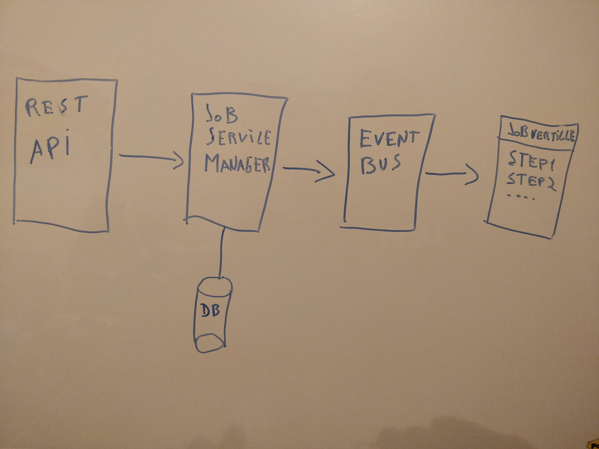
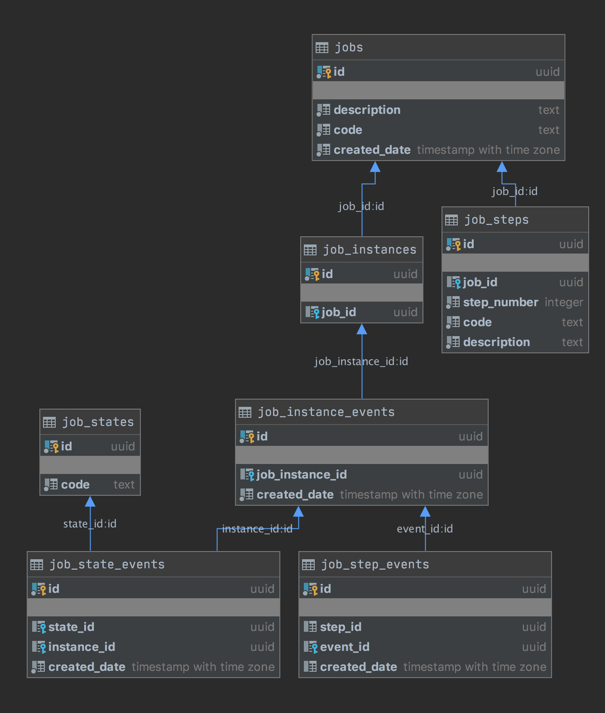

= Jobmanager

image:https://img.shields.io/badge/vert.x-3.9.0-purple.svg[link="https://vertx.io"]

== General notes

The idea is to have a job manager that is able to process jobs in a modular way, using vert.x.
To make a new job available, we just need to develop a verticle with the logic for all the steps and register it using the rest api.

=== Architeture


=== Datamodel


=== Run
```
docker-compose up
run schema.sql and states.sql using some database.client
./gradlew run
```
At this moment only register functionality is implemented

